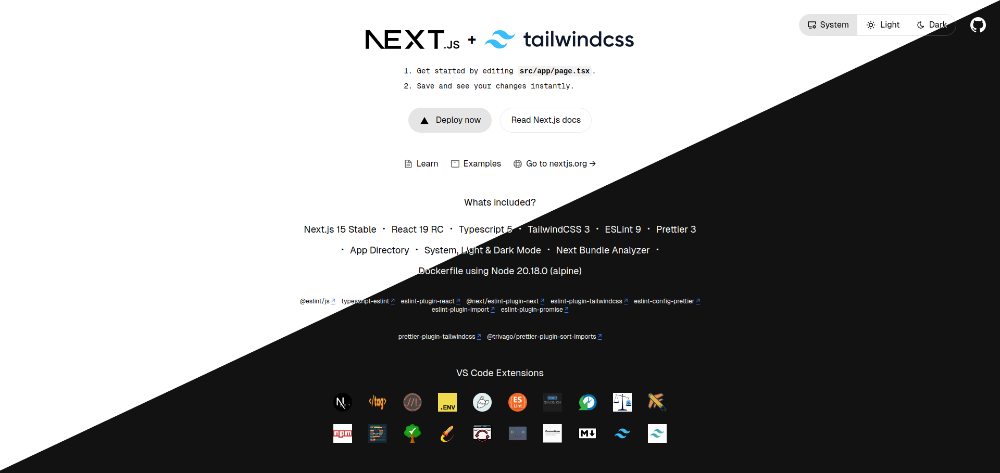

# NextCMS 

   


A **production-ready** full-stack CMS and e-commerce platform built with **Next.js 16** and **React 19**. Features include a complete admin backend, shopping cart, payment processing, multilingual support, and flexible content management system.



## 🎯 Platform Overview

This platform serves as:

- **Full-Stack CMS**: Complete content management with admin backend and modular navigation
- **E-commerce Solution**: Shopping cart, payment processing, order management, and inventory control
- **Headless CMS**: API-first architecture with public/private endpoints
- **Hybrid Deployment**: Frontend + Backend + API in a single deployment

### 🏗️ Core Architecture

- **Multi-Database Support**: Auto-detects, PostgreSQL, or Firebase
- **Dynamic Authentication**: NextAuth v5 with runtime OAuth provider configuration
- **Role-Based Access Control**: Dynamic roles and permissions from database
- **Unified API System**: Public/private endpoints with CSRF protection and rate limiting
- **Advanced Caching**: Multi-layer cache system (backend, frontend and api)
- **Multilingual**: next-intl with locale detection and fallback support

## ✨ Key Features

### E-commerce
- Shopping cart with persistent state (react-use-cart)
- Payment processing: **Stripe**, **EuPago** (MB Way, Multibanco, PayShop), **SumUp**
- Complete order lifecycle management
- VAT calculations and tax handling
- Coupon and discount system
- Customer profiles and order history
- Product catalog with categories, collections, and attributes

### Content Management
- Dynamic content blocks system
- Media library with file management
- SEO optimization tools
- Multi-language content support
- Flexible page builder

### Admin Backend
- **Dashboard**: Analytics and reports
- **Access Control**: Users, roles, and permissions
- **Store Management**: Orders, catalog, inventory, customers, coupons
- **Media Library**: File upload and organization
- **Workspace**: Task board, agenda, scheduling
- **Marketing**: Newsletter campaigns, subscriber management
- **Developer Tools**: Database management, API endpoints, AI agent, cronjobs
- **System**: Settings, maintenance, cache management

### Developer Features
- Database abstraction layer with ORM
- Server-side functions for backend operations
- Automatic cache clearing on data mutations
- Professional email templates with Nodemailer
- Web3 integration (wallet management, transactions)
- Visitor analytics and tracking

## 🚀 Tech Stack

- **Framework**: Next.js 16 (App Router)
- **Frontend**: React 19
- **Language**: JavaScript/TypeScript 5
- **Styling**: Tailwind CSS 4
- **UI Components**: Shadcn/ui, Radix UI
- **Code Quality**: Biome (linting & formatting)
- **State Management**: Redux Toolkit 9, React Context
- **Forms**: React Hook Form + Zod validation
- **Authentication**: NextAuth 5
- **Internationalization**: next-intl (4.3.4)
- **Email**: React Email (4.2.8) + Nodemailer (7.0.5)
- **SMS**: Twilio
- **Payments**: Stripe, EuPago, SumUp
- **Database**: PostgreSQL (Firebase optional) (auto-detection)
- **Storage**: R2 / S3 Storage (AWS) , Firebase Hosting + Buckets
- **Charts**: Recharts
- **Icons**: Lucide React, React Icons

## 🛠️ Core Dependencies

### Framework & UI
- **next** (16.0.7) - React framework with App Router
- **react** (19.1.2) & **react-dom** (19.1.2)
- **tailwindcss** (4.1.12) - Utility-first CSS
- **shadcn** - UI components library for Tailwind CSS
- **@radix-ui/** - Headless UI components
- **lucide-react** (0.542.0) - Icon library
- **framer-motion** (12.23.12) - Animation library
- **recharts** (3.2.1) - Analytics charts

### Authentication & Security
- **next-auth** (5.0.0-beta.29) - Authentication
- **bcryptjs** (3.0.2) - Password hashing
- **crypto-js** (4.2.0) - Encryption
- **react-turnstile** (1.1.4) - Cloudflare CAPTCHA

### E-commerce & Payments
- **react-use-cart** (1.14.0) - Shopping cart
- **stripe** (18.4.0) & **@stripe/stripe-js** (7.8.0)
- **eupago** (curl) - MBWay and Multibanco payment gateway by EuPago
- **sumup** (curl) - Credit & Debit card payment gateway by SumUp

### Database & Storage
- **pg** - Postgres
- **aws-s3** - R2 / S3 Storage

### Forms & Validation
- **react-hook-form** (7.62.0) - Form management
- **zod** (4.1.8) - Schema validation
- **@hookform/resolvers** (5.2.2)

### Additional Features
- **web3** (4.16.0) - Blockchain integration
- **@googlemaps/js-api-loader** (1.16.10) - Google Maps
- **vanilla-cookieconsent** (3.1.0) - GDPR compliance
- **sonner** (2.0.7) - Toast notifications
- **next-themes** (0.4.6) - Theme management

### Development Tools
- **@biomejs/biome** (2.2.6) - Fast linter & formatter (replaces ESLint + Prettier)
- **typescript** (5.9.2)
- **@next/bundle-analyzer** (15.5.7) - Bundle analysis

## 🏁 Getting Start
### Prerequisites

- **Node.js**: Version 20.18.0 or higher
- **Database**: PostgreSQL, or Firebase Real-Time DB (auto-detects from .env variables)

### Installation

1. **Clone the Repository**:
    ```bash
    git clone <repository-url>
    cd cbd-shop
    ```

2. **Install Dependencies**:
    ```bash
    npm install
    # or
    yarn install
    # or
    pnpm install
    # or
    bun install
    ```

3. **Configure Environment Variables**:
   
   Create a `.env.local` file with the following variables:
   
   ```env
   # Authentication
   NEXTAUTH_URL=http://localhost:3000
   NEXTAUTH_SECRET=your-secret-key
   
   # Database (choose one)
   POSTGRES_URL=postgresql://...
   # or
   FIREBASE_CONFIG={"apiKey":"..."}

   # Storage
   S3_***=
   ```

4. **Run Development Server**:
    ```bash
    npm run dev
    ```
   
   Open [http://localhost:3000](http://localhost:3000) in your browser.

5. **Build for Production**:
    ```bash
    npm run build
    npm start
    ```

## 📝 Available Scripts

```bash
npm run dev          # Start development server with Turbopack
npm run build        # Build for production
npm start            # Start production server
npm run biome        # Check code quality
npm run biome:fix    # Auto-fix code issues
npm run format       # Format code
npm run check        # Run all checks
npm run email-dev    # Preview email templates
```


## 🗂️ Project Structure

```
├── src/
│   ├── app/                    # Next.js App Router
│   │   ├── (backend)/          # Backend admin panel
│   │   ├── (frontend)/         # Public pages / Storefront / Authentication pages
│   │   ├── auth/               # Authentication routes
│   │   ├── api/                # API routes 
│   ├── components/             # React components
│   │   ├── ui/                 # Shadcn/ui components
│   │   ├── common/             # Shared components
│   │   └── shop/               # E-commerce components
│   ├── context/                # React Context providers
│   ├── data/                   # Database abstraction layer
│   │   ├── postgres.db.js      # PostgreSQL provider
│   │   ├── firebase.db.js      # Firebase provider
│   │   └── rest.db.js          # Unified DB service
│   ├── emails/                 # Email templates
│   ├── hooks/                  # Custom React hooks
│   ├── lib/
│   │   ├── server/             # Server-side utilities
│   │   │   ├── admin.js        # Admin data operations
│   │   │   ├── store.js        # Storefront data operations
│   │   │   ├── email.js        # Email service operations
│   │   │   └── more..          # Other server utilities 
│   │   └── client/             # Client-side utilities
│   │   └── shared/             # Shared utilities (Helpers, Cache operations, etc)
│   ├── locale/                 # Internationalization
│   └── utils/                  # Utility functions
├── docs/                       # Documentation
├── public/                     # Static assets
└── .github/                    # GitHub configuration / Copilot Instructions for fast development
```

## 📚 Documentation

Detailed documentation is available in the `/docs` directory:

## 🚢 Deployment

### Vercel (Recommended)

1. Push your code to GitHub
2. Import project in Vercel
3. Configure environment variables
4. Deploy automatically

### Other Platforms

- **Netlify**: Full Node.js support with serverless functions
- **Railway**: One-click deployment with PostgreSQL
- **DigitalOcean**: App Platform with managed databases
- **Self-hosted**: Any Node.js environment with PM2

## 🤝 Contributing

Contributions are welcome! Please feel free to submit a Pull Request.

## 📄 License

This project is licensed under the MIT License. See the [LICENSE](LICENSE) file for details.

---

<p align="center">Built with ❤️ using Next.js 16</p>
